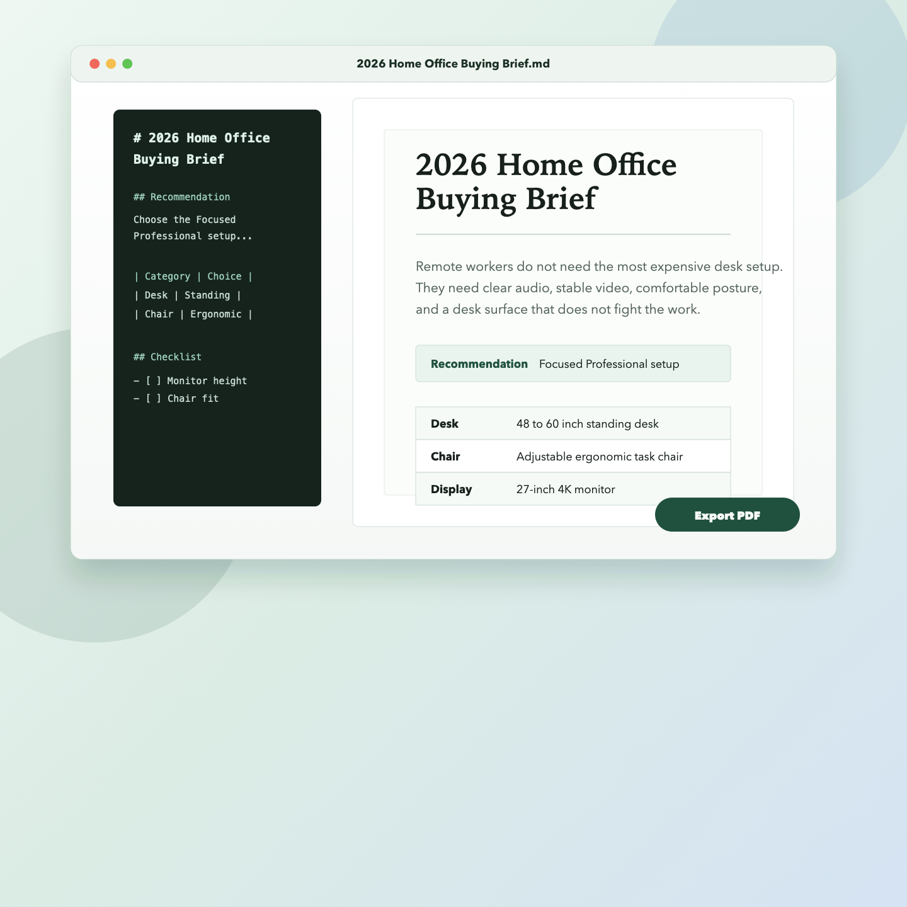

# ViewMD

**Your AI gives you Markdown. ViewMD makes it readable.**

ViewMD is a native Mac app for opening AI-generated `.md` files, reading them as polished documents, and exporting clean PDFs beside the source file.

It is built for people who get reports, plans, research, specs, and notes from AI tools or coding agents and want the result to feel like a normal Mac document.



## The Workflow

1. Double-click a `.md` file.
2. Read it in a finished document view.
3. Click **Export PDF** to create a shareable PDF next to the original file.

No upload step. No browser tab. No moving a file back out of Downloads.

## Why It Exists

AI tools often hand you Markdown because Markdown is portable and easy to generate. That does not mean it is pleasant to read or share.

ViewMD closes the gap between raw AI output and a presentable document.

## Features

- Opens `.md`, `.markdown`, `.mdown`, and `.mkd` files on macOS.
- Renders headings, lists, tables, links, images, code blocks, and task lists.
- Shows Markdown in a PDF-style reading layout.
- Exports PDF using the same basename as the source file.
- Defaults export beside the source Markdown file.
- Confirms before replacing an existing PDF.
- Keeps file contents local on your Mac.

## Download

The first public beta is distributed through GitHub Releases as an unsigned Mac build.

Download unsigned public beta: [ViewMD 1.0.0 release](https://github.com/cdraarsh/viewmd/releases/tag/v1.0.0)

This build is not notarized because ViewMD is not yet distributed through the paid Apple Developer Program. macOS will warn before opening it. If you are not comfortable opening an unsigned Mac app, build from source instead.

## Install Unsigned Public Beta

1. Download `ViewMD-1.0.0-mac-universal-unsigned.zip` and `ViewMD-1.0.0-mac-universal-unsigned.zip.sha256` from GitHub Releases.
2. Verify the checksum:
   ```bash
   shasum -a 256 -c ViewMD-1.0.0-mac-universal-unsigned.zip.sha256
   ```
3. Unzip the file.
4. Move `ViewMD.app` to Applications.
5. Try opening ViewMD once.
6. If macOS blocks it, use Apple's per-app override: open **System Settings -> Privacy & Security**, then choose **Open Anyway** for ViewMD.
7. Right-click a Markdown file, choose **Open With**, then choose **ViewMD**.

If you want ViewMD to open Markdown files by default, use Finder's **Get Info** panel and choose **Change All** under **Open with**.

Apple's guide for opening an app from an unknown developer: [Open a Mac app from an unknown developer](https://support.apple.com/guide/mac-help/open-a-mac-app-from-an-unknown-developer-mh40616/mac)

## Privacy

ViewMD reads local files on your Mac. It does not upload Markdown content to a server.

## Public Beta Feedback

ViewMD is looking for feedback from Mac users who already receive Markdown from ChatGPT, Claude, Cursor, Codex, or other AI tools.

The most useful test:

1. Open one real AI-generated `.md` file.
2. Read it in ViewMD.
3. Export one PDF.
4. Tell us where you got stuck.

Send feedback: [Public beta feedback form](https://github.com/cdraarsh/viewmd/issues/new?template=feedback.yml)  
Report a bug: [Bug report form](https://github.com/cdraarsh/viewmd/issues/new?template=bug_report.yml)

## Known Limitations

- ViewMD is reader-first. It is not a Markdown editor.
- The first launch is not planned for the Mac App Store.
- The first public beta is unsigned and not notarized. A future broad consumer release should be Developer ID signed and notarized.
- Very large documents may take longer to render or export.
- Some advanced Markdown extensions may render differently than your AI tool's preview.

## Build From Source

Requirements:

- macOS 13 or newer
- Swift 5.9 or newer

For technical users, building locally is the cleaner trust path.

```bash
cd ViewMD
swift build
swift test
cd ..
./scripts/release-build.sh --unsigned-public-beta
```

For a quick local app bundle without the release zip:

```bash
cd ViewMD
./build-app.sh --unsigned-public-beta
```

The app bundle is created at `ViewMD/build/ViewMD.app`; the unsigned release zip and checksum are created under `ViewMD/build/dist/`.

## Launch Docs

- [Broad awareness launch plan](docs/BROAD_AWARENESS_LAUNCH.md)
- [Launch copy](docs/LAUNCH_COPY.md)
- [Feedback playbook](docs/FEEDBACK_PLAYBOOK.md)
- [Release notes](docs/RELEASE_NOTES_v1.0.0.md)
- [Release operations](docs/RELEASE_OPERATIONS.md)
